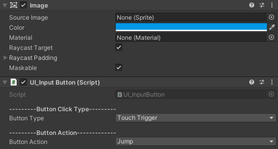
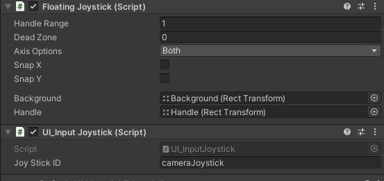
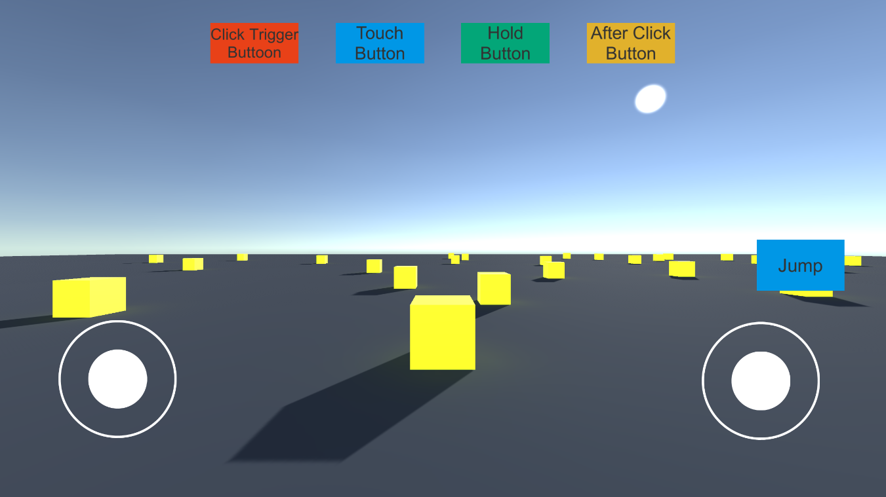

# Unity_UI_InputSystem

Buttons and Joystick UI input system with a FPS Example

### Developement info:
Developed in Unity <strong>2020.3.7f1</strong> <br>
Didn't test this with older Unity versions, but it should work fine! <br>

Uses the FREE asset <a href='https://assetstore.unity.com/packages/tools/input-management/joystick-pack-107631'> Joystick Pack </a> from the asset store for the joysticks! Asset made by <a href='https://assetstore.unity.com/publishers/32730'> Fenerax Studios</a>! <br>

# SetUp

## 1. Create your actions
* Add your desired actions in InputEnums.cs

```C#
namespace UI_Inputs.Enums
{
    public enum ButtonAction 
    {
        Jump,
        Action1,
        Action2, 
        Action3,
        Action4
    }

    public enum JoyStickAction
    {
        Movement,
        CameraLook
    }
}
```

## 2. Button setup
* Assign "UI_InputButton.cs" to a UI element with an image (clickable area)! <br>
* Choose the desired action for the button created from the InputEnums! Example: Jump, Run, Shoot... <br>

 <br>
<strong> Obs: </strong> Compatible with: "Click Trigger", "Touch Trigger", "Hold Trigger" and "After Click Trigger"

## 3. Joystick setup
* Assign "UI_InputJoystick.cs" to a Joystick from the asset pack (can be any type of joystick [Fixed, Floating etc...]). <br>
* Choose the desired Joystick Action for the Joystick created from the InputEnums! Example: joystickCamera, joystickPlayerMovement... <br>



## 4. Create your inputs
* These are the default functions to call in your script (bool, float and Vector2 ready).
* If you want to add other type of functions add them to UI_InputSystem.

```C#
public static Vector2 GetAxisValue(JoyStickAction joystickToChek) => JoyStickProcessor(joystickToChek);
public static float GetAxisHorizontal(JoyStickAction joystickToChek) => JoyStickProcessor(joystickToChek).x;
public static float GetAxisVertical(JoyStickAction joystickToChek) => JoyStickProcessor(joystickToChek).y;
public static bool GetButton(ButtonAction buttonToCheck) => ButtonPressProcessor(buttonToCheck);
```

## 5. Using inputs
* Call "UI_InputSystem" on your desired controllers, add the desired command wanted and done!
* The class is static so no need to add to your scene and use Singleton.
* Remeber to add UI_Inputs.Enums namespace in your script to use ButtonAction and JoyStickAction Enums.

```C#
using UI_Inputs.Enums;

//Jump Example
void ProcessJumping()
{
    if (!canJump)
        return;

    if (UI_InputSystem.GetButton(ButtonAction.Jump) && isGrounded)      
        gravityVelocity.y = JumpForce();      
}

//Movement Example
Vector3 PlayerMovementDirection()
{
    Vector3 baseDirection = playerTransform.right * UI_InputSystem.GetAxisHorizontal(JoyStickAction.Movement) +
                            playerTransform.forward * UI_InputSystem.GetAxisVertical(JoyStickAction.Movement);

    baseDirection *= playerHorizontalSpeed * Time.deltaTime;
    return baseDirection;
}
```
<strong> Obs: </strong> This code is located in "PlayerMovement.cs"

## FPS Example
 <br>
<strong> Obs: </strong> Uses my <strong> <a href='https://github.com/playjoa/Unity_SimpleCharacterController_FPS'> Simple Character Controller </a> </strong> adapted to use with this UI input system.
