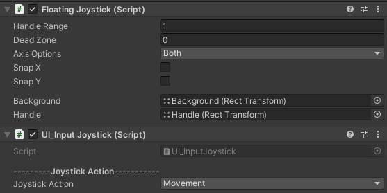

# Unity_UI_InputSystem

Buttons and Joystick UI input system with a FPS Example

### Developement info:
Developed in Unity <strong>2020.3.7f1</strong> <br>
Didn't test this with older Unity versions, but it should work fine! <br>

Uses the FREE asset <a href='https://assetstore.unity.com/packages/tools/input-management/joystick-pack-107631'> Joystick Pack </a> from the asset store for the joysticks! Asset made by <a href='https://assetstore.unity.com/publishers/32730'> Fenerax Studios</a>! <br>

# SetUp

## Create You Actions
* Add your desired actions in InputEnums.cs

```C#
namespace UI_Inputs.Enums
{
    public enum ButtonAction 
    {
        Jump,
        Action1,
        Action2, 
        Action3,
        Action4
    }

    public enum JoyStickAction
    {
        Movement,
        CameraLook
    }
}
```

## Button
* Assign "UI_InputButton.cs" to a UI element with an image (clickable area)! <br>
* Choose the desired action for the button created from the InputEnums! Example: Jump, Run, Shoot... <br>

 <br>
<strong> Obs: </strong> Compatible with: "Click Trigger", "Touch Trigger", "Hold Trigger" and "After Click Trigger"

## Joysticks
* Assign "UI_InputJoystick.cs" to a Joystick from the asset pack (can be any type of joystick [Fixed, Floating etc...]) <br>
* Choose the desired Joystick Action for the Joystick created from the InputEnums! Example: joystickCamera, joystickPlayerMovement... <br>




## Create Inputs
* Add your commands along with the Actions in "UI_InputSystem.cs" (bool and Vector2 ready)

```C#
public static Vector2 PlayerMovementDirection => JoyStickProcessor(JoyStickAction.Movement);

public static float Camera_X_Movement => JoyStickProcessor(JoyStickAction.CameraLook).x;

public static float Camera_Y_Movement => JoyStickProcessor(JoyStickAction.CameraLook).y;

public static bool JumpInput => ButtonPressProcessor(ButtonAction.Jump);

public static bool ClickInput => ButtonPressProcessor(ButtonAction.Action1);

public static bool AfterClickInput => ButtonPressProcessor(ButtonAction.Action2);

public static bool HoldClickInput => ButtonPressProcessor(ButtonAction.Action3);

public static bool TouchInput => ButtonPressProcessor(ButtonAction.Action4);
```

## Using Inputs
* Call "UI_InputSystem" on your desired controllers and done!
* The class is static so no need to add to your scene and use Singleton

```C#
    Vector3 PlayerMovementDirection()
    {
        Vector3 baseDirection = playerTransform.right * UI_InputSystem.PlayerMovementDirection.x +
                                playerTransform.forward * UI_InputSystem.PlayerMovementDirection.y;

        baseDirection *= playerHorizontalSpeed * Time.deltaTime;

        return baseDirection;
    }
```
<strong> Obs: </strong> This code is located in "PlayerMovement.cs"

## FPS Example
 <br>
<strong> Obs: </strong> Uses my <strong> <a href='https://github.com/playjoa/Unity_SimpleCharacterController_FPS'> Simple Character Controller </a> </strong> adapted to use with this UI input system.
